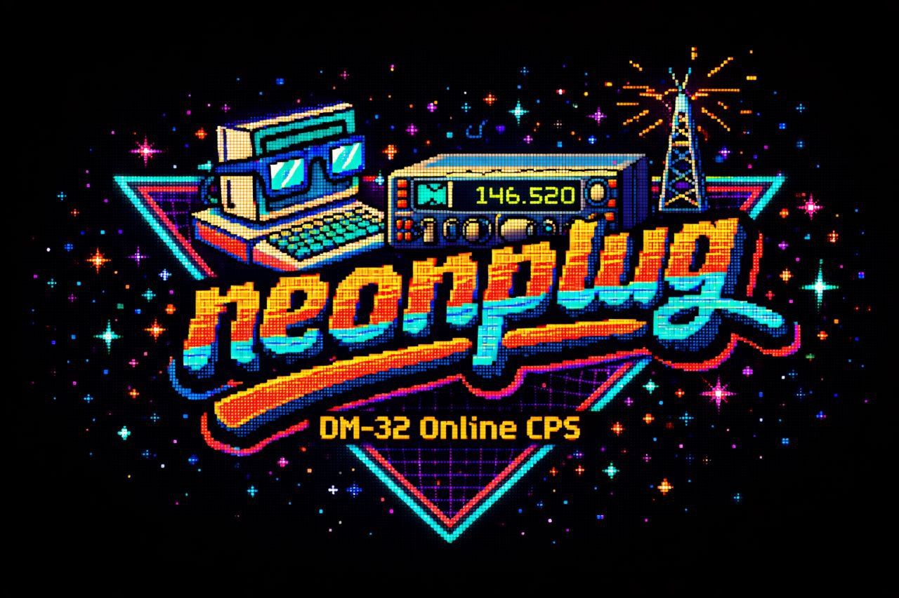
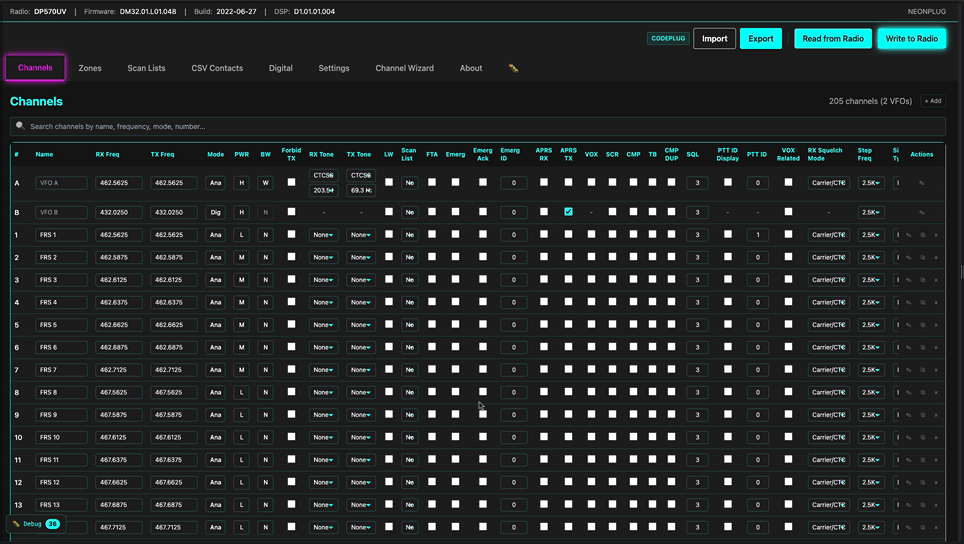

# NEONPLUG

**A modern, web-based Customer Programming Software (CPS) for the Baofeng DM-32UV radio.**

Program your DMR radio directly from your browser—no software installation required. NeonPlug brings a sleek, cyberpunk-themed interface with powerful features for managing channels, contacts, zones, and more.

**🚀 Try it live:** [https://neonplug.app](https://neonplug.app) · **📥 [Download offline version](https://neonplug.app)** (single-file, no install)

**💬 Join us:** 

> ⚠️ **Note:** Currently in active development. Some features are still being implemented.

---

## ✨ Demo

*Create channels, manage contacts, and program your radio—all from your browser.*

---

## 🎯 Key Features

### 📻 Radio Management
- **Direct USB Connection** - Connect your DM-32UV via Web Serial API (no drivers needed)
- **Read & Write** - Full codeplug read/write support
- **Live Validation** - Real-time frequency and configuration validation

### 📡 Channel Configuration
- **Smart Import** - Location-based channel wizard using repeater databases
- **Bulk Editing** - Powerful table interface for editing multiple channels at once
- **Codeplug backup** - Save and load a full codeplug as a `.neonplug` file (zipped JSON)
- **Chirp CSV** - Import and export channels in CHIRP CSV format; custom CSV import also supported
- **Auto-Configuration** - Automatic offset, CTCSS, and color code detection

The `.neonplug` file is a zipped JSON archive. You can unzip it to inspect the contents in a semi-human-readable way (e.g. `codeplug.json` inside the zip). Editing the JSON directly is not recommended—use NeonPlug’s import/export and in-app editing instead to avoid invalid data or corruption.

### 👥 Contact & Group Management
- **Digital Contacts** - Manage DMR contacts with full talk group support
- **RX Groups** - Create and organize receive groups
- **Scan Lists** - Configure scan lists across zones

### 🎨 Modern Interface
- **Cyberpunk Theme** - Eye-catching neon UI that's both beautiful and functional
- **Responsive Design** - Works seamlessly on desktop and tablet
- **Dark Mode Native** - Easy on the eyes during long programming sessions

---

## 🚀 Getting Started

Just visit **[neonplug.app](https://neonplug.app)** in a Chrome-based browser (Chrome, Edge, Opera, Brave). No installation needed!

**Requirements:**
- Chrome, Edge, Opera, or Brave browser (for Web Serial API support)
- Baofeng DM-32UV radio with USB cable

### 📥 Offline mode

You can use NeonPlug without an internet connection. From the live app:

1. On the startup screen, click **Download offline version (ZIP)**  
   — or open **Settings → About** and click **Download Offline Version (ZIP)**.
2. Save the ZIP, unzip it, and open **neonplug.html** in your browser.

The file is a single, self-contained HTML (all assets inlined). No server or network required; Web Serial for the radio still works when the file is opened locally.

---

## 🤝 Contributing

We welcome contributions from everyone—not just developers!

**Ways to help:**
- 🧪 **Test the app** and report bugs or issues
- 💡 **Share ideas** for new features
- 📣 **Spread the word** about NeonPlug to other radio enthusiasts
- 💻 **Code contributions** - Check out our [Contributing Guide](CONTRIBUTING.md)

**For developers:** See our [Contributing Guide](CONTRIBUTING.md) for setup instructions, architecture overview, and guidelines.

This project was built with the assistance of AI, but all design decisions and architecture are intentional and human-guided.

---

## 📜 License

MIT License - feel free to use this project for your own radio programming needs!

---

## 💬 Community

Have questions or want to share your experience? Join our Discord community!

